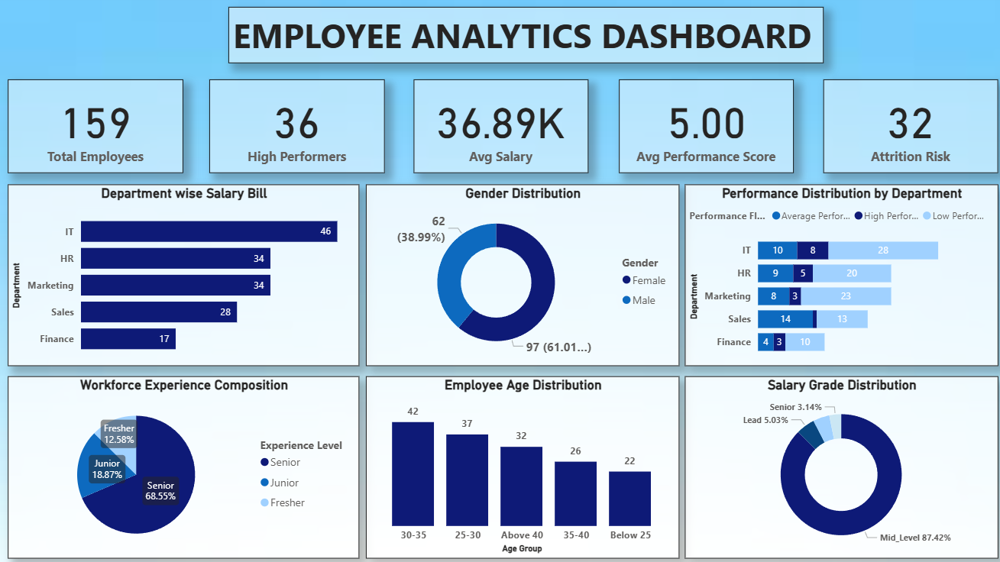
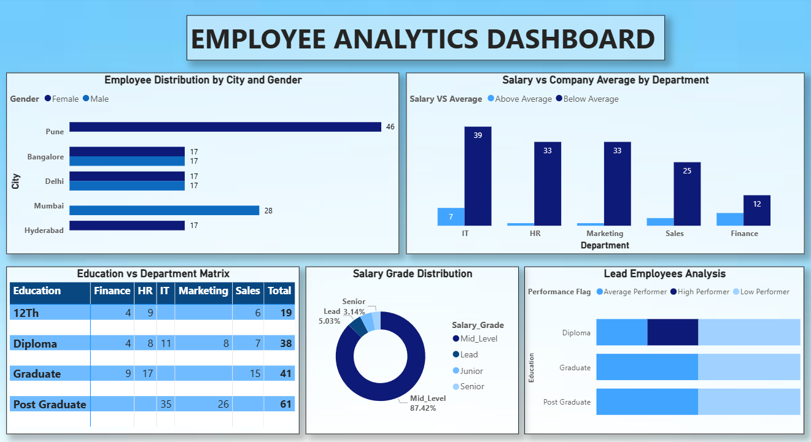

# 🧹 Employee Data Analysis — Data Cleaning & Analytics Project

> A complete end-to-end data analytics project demonstrating professional **data cleaning with Pandas & NumPy** and **interactive business insights with Power BI (DAX)**.

---

## 📌 Project Overview

This project simulates a real-world HR analytics scenario where raw, messy employee data is collected from multiple sources. The data contains numerous quality issues — nulls, duplicates, invalid values, inconsistent formatting — which are resolved through a structured data cleaning pipeline before being loaded into a Power BI dashboard for business insights.

| | Before Cleaning | After Cleaning |
|---|---|---|
| **Rows** | 200 | 159 |
| **Columns** | 15 | 21 |
| **Duplicates** | 15 | 0 |
| **Null Values** | 13–35 per column | 0 |
| **Invalid Ages** | Present (e.g., -5, 999) | Fixed |
| **Inconsistent Categories** | Present (Male/male/M) | Standardized |

---

## 📸 Power BI Dashboard

> 💡 **To explore the full interactive dashboard:** Download `Employee_Analytics_Dashboard.pbix` and open it in [Power BI Desktop](https://powerbi.microsoft.com/desktop/) (free to download).

### 📊 Page 1 — Employee Overview


*Covers overall headcount, department-wise employee distribution, gender ratio, education level breakdown, city-wise presence, and salary grade summary.*

---

### 📈 Page 2 — Performance & Salary Analysis


*Covers performance score distribution (Poor / Average / Good / Excellent), average salary by department and city, total compensation bill, high performer percentage, and experience vs salary trend.*

---

## 🗂️ Project Structure

```
employee-data-analysis/
│
├── assets/
│   ├── dashboard_page1_overview.png               # Power BI Page 1 screenshot
│   └── dashboard_page2_performance_salary.png     # Power BI Page 2 screenshot
│
├── data/
│   ├── messy_employee_data.csv                    # Raw dataset with all data quality issues
│   └── Cleaned_Employee_Dataset.csv               # Final cleaned & enriched dataset
│
├── Employee_Analytics_Dashboard.pbix              # Power BI dashboard file
├── data_cleaning.ipynb                            # Jupyter Notebook — full cleaning pipeline
└── README.md
```

---

## 🔧 Data Quality Issues Found

| Problem | Column(s) | Details |
|---|---|---|
| Null values | All columns | 13–35 nulls per column |
| Duplicate IDs | Employee_ID | 15 duplicate entries |
| Inconsistent categories | Gender | Male, male, MALE, M, F |
| Inconsistent categories | City | Mumbai, mumbai, PUNE |
| Inconsistent categories | Department | Sales, sales, SALES, H.R |
| Invalid values | Age | -5, 150, 999 — impossible ages |
| Invalid values | Salary | -5000, 0, 999999 — impossible salaries |
| Invalid values | Experience_Years | -2, 50, 100 — impossible values |
| Invalid values | Performance_Score | -1, 11, 100 — should be 1–10 |
| Extra whitespace | Employee_Name | "  Amit Kumar  " with spaces |
| Mixed date formats | Joining_Date | 5 different date formats + invalid dates |
| Invalid phone numbers | Phone_Number | Too short, too long, non-numeric |
| Invalid emails | Email | Missing @, missing domain, etc. |
| Mixed data types | Salary_Text | Same salary stored as "Rs. 50000/-" |

---

## 🐼 Data Cleaning Pipeline (Pandas & NumPy)

### Step 1 — Import Libraries & Load Data
```python
import pandas as pd
import numpy as np

df = pd.read_csv('messy_employee_data.csv')
```

### Step 2 — Exploratory Data Analysis (EDA)
```python
df.head()
df.shape
df.info()
df.describe()
df.isnull().sum()
(df.isnull().sum() / len(df)) * 100
```

### Step 3 — Remove Duplicates
```python
df = df.drop_duplicates(subset='Employee_ID', keep='first')
df = df.reset_index(drop=True)
print("Shape after removing duplicates:", df.shape)
```

### Step 4 — Fix Whitespace in Text Columns
```python
df['Employee_Name'] = df['Employee_Name'].str.strip()
df['Employee_Name'] = df['Employee_Name'].str.replace(r'\s+', ' ', regex=True)
df['Gender'] = df['Gender'].str.strip()
df['City'] = df['City'].str.strip()
df['Department'] = df['Department'].str.strip()
```

### Step 5 — Standardize Categorical Columns
```python
# Gender
df['Gender'] = df['Gender'].str.strip().str.title()
df['Gender'] = df['Gender'].replace({'M': 'Male', 'F': 'Female'})

# Department
df['Department'] = df['Department'].str.strip().str.title()
df['Department'] = df['Department'].replace({'It': 'IT', 'H.R': 'HR', 'Hr': 'HR'})

# City
df['City'] = df['City'].str.strip().str.title()
```

### Step 6 — Fix Invalid Numeric Values with NumPy
```python
# Age: valid range 18–65
df['Age'] = np.where((df['Age'] < 18) | (df['Age'] > 65), np.nan, df['Age'])

# Salary: valid range 1–500,000
df['Salary'] = np.where((df['Salary'] <= 0) | (df['Salary'] > 500000), np.nan, df['Salary'])

# Experience: valid range 0–40
df['Experience_Years'] = np.where(
    (df['Experience_Years'] < 0) | (df['Experience_Years'] > 40), np.nan, df['Experience_Years']
)

# Performance Score: valid range 1–10
df['Performance_Score'] = np.where(
    (df['Performance_Score'] < 1) | (df['Performance_Score'] > 10), np.nan, df['Performance_Score']
)
```
> 💡 `np.where` works like Excel's IF formula — if condition is True, replace with NaN; else keep original value.

### Step 7 — Handle Null Values
```python
# Numeric — fill with MEDIAN (robust against outliers)
df['Age'] = df['Age'].fillna(df['Age'].median())
df['Salary'] = df['Salary'].fillna(df['Salary'].median())
df['Experience_Years'] = df['Experience_Years'].fillna(df['Experience_Years'].median())
df['Performance_Score'] = df['Performance_Score'].fillna(df['Performance_Score'].median())
df['Monthly_Bonus'] = df['Monthly_Bonus'].fillna(df['Monthly_Bonus'].median())

# Categorical — fill with MODE (most frequent value)
df['Gender'] = df['Gender'].fillna(df['Gender'].mode()[0])
df['City'] = df['City'].fillna(df['City'].mode()[0])
df['Department'] = df['Department'].fillna(df['Department'].mode()[0])
df['Education'] = df['Education'].fillna(df['Education'].mode()[0])

# Drop rows where Employee_ID or Name is null
df = df.dropna(subset=['Employee_ID', 'Employee_Name'])
df = df.reset_index(drop=True)
```
> 💡 Median is preferred over mean for salary/age because extreme outliers skew the mean drastically.

### Step 8 — Fix Data Types
```python
df['Age'] = df['Age'].astype(int)
df['Salary'] = df['Salary'].astype(int)
df['Experience_Years'] = df['Experience_Years'].astype(int)
df['Performance_Score'] = df['Performance_Score'].astype(int)
df['Monthly_Bonus'] = df['Monthly_Bonus'].astype(int)
print(df.dtypes)
```

### Step 9 — Validate Phone Numbers & Emails
```python
# Phone: valid = exactly 10 digits
df['Phone_Valid'] = df['Phone_Number'].apply(
    lambda x: 'Valid' if pd.notnull(x) and str(x).isdigit() and len(str(x)) == 10 else 'Invalid'
)

# Email: regex validation
import re
def validate_email(email):
    if pd.isnull(email): return 'Missing'
    pattern = r'^[\w\.-]+@[\w\.-]+\.\w+$'
    return 'Valid' if re.match(pattern, str(email)) else 'Invalid'

df['Email_Valid'] = df['Email'].apply(validate_email)
```

### Step 10 — Feature Engineering with NumPy
```python
# Salary Grade using np.select
conditions = [
    df['Salary'] < 40000,
    (df['Salary'] >= 40000) & (df['Salary'] < 80000),
    (df['Salary'] >= 80000) & (df['Salary'] < 120000),
    df['Salary'] >= 120000
]
choices = ['Junior', 'Mid Level', 'Senior', 'Lead']
df['Salary_Grade'] = np.select(conditions, choices, default='Unknown')

# Performance Category
df['Performance_Category'] = pd.cut(
    df['Performance_Score'], bins=[0, 3, 6, 8, 10],
    labels=['Poor', 'Average', 'Good', 'Excellent']
)

# Total Compensation
df['Total_Compensation'] = df['Salary'] + df['Monthly_Bonus']

print(df['Salary_Grade'].value_counts())
print(df['Performance_Category'].value_counts())
```

### Step 11 — Save Cleaned Data
```python
df.to_csv('Cleaned_Employee_Dataset.csv', index=False)
print("✅ Cleaned data saved! Final shape:", df.shape)
```

---

## 📊 DAX Queries Used in Power BI

```dax
-- Total Employees
Total Employees = COUNTROWS(Employees)

-- Average Salary
Avg Salary = AVERAGE(Employees[Salary])

-- Average Performance Score
Avg Performance = AVERAGE(Employees[Performance_Score])

-- Total Compensation Bill
Total Compensation = SUM(Employees[Total_Compensation])

-- Headcount by Department
Headcount by Dept =
CALCULATE(COUNTROWS(Employees), ALLEXCEPT(Employees, Employees[Department]))

-- High Performers (Score >= 8)
High Performers =
CALCULATE(COUNTROWS(Employees), Employees[Performance_Score] >= 8)

-- High Performer Percentage
High Performer % = DIVIDE([High Performers], [Total Employees], 0)

-- Average Salary by Department
Avg Salary Dept =
CALCULATE(AVERAGE(Employees[Salary]), ALLEXCEPT(Employees, Employees[Department]))
```

---

## 🛠️ Tools & Technologies

| Tool | Purpose |
|---|---|
| Python 3 | Data cleaning & processing |
| Pandas | DataFrame operations, null handling, type conversion |
| NumPy | Vectorized validation, np.where, np.select |
| Regex (re) | Email pattern validation |
| Power BI | Dashboard & business insights |
| DAX | Calculated measures in Power BI |
| Jupyter Notebook | Cleaning pipeline documentation |
| GitHub | Version control & project showcase |

---

## 📁 Dataset Description

### Raw Dataset — `messy_employee_data.csv`
- **200 rows × 15 columns**
- Columns: Employee_ID, Employee_Name, Age, Gender, City, Department, Salary, Experience_Years, Education, Performance_Score, Joining_Date, Phone_Number, Email, Monthly_Bonus, Salary_Text

### Cleaned Dataset — `Cleaned_Employee_Dataset.csv`
- **159 rows × 21 columns**
- All original columns + 6 new derived columns: Phone_Valid, Email_Valid, Salary_Grade, Total_Compensation, Performance_Category

---

## 🎯 Key Learnings

- **Always explore before cleaning** — understand the data fully before writing a single cleaning line
- **Median > Mean** for imputing numeric columns when outliers are present
- **np.where and np.select** are highly efficient for conditional replacements on large datasets
- **str.title() + replace()** is the cleanest pattern for standardizing mixed-case categorical values
- **Validate, don't just delete** — flagging invalid phone/email preserves data for follow-up instead of silently dropping it
- **Feature engineering adds business value** — derived columns like Salary_Grade and Performance_Category make dashboards far more insightful

---

## 👩‍💻 Author

**Pooja**
Data Analytics Enthusiast | Python • Pandas • NumPy • Power BI

---

## 📄 License

This project is open source and available under the [MIT License](LICENSE).
